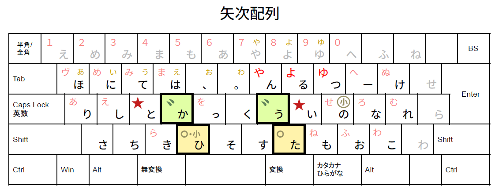
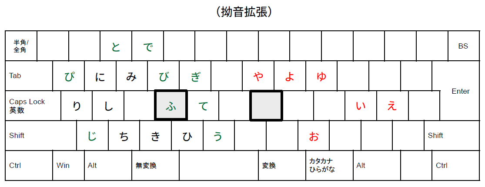

# 矢次配列 - Yazgi Layout

***Y***et ***A***nother Next (= Tsugi = ***zgi***) ***Z***-***G***eneration Japanese ***I***nput Layout

[新下駄配列](https://kouy.exblog.jp/13627994/)の哲学を継承しつつ、より覚えやすく身近に。

----

中指同時シフト・拗音拡張・清濁同置。（→ [設計思想](docs/design.md)） 
新下駄および、[JIS下駄](https://github.com/ffunatsu/jis_geta)、薙刀式、新JISなどに影響を受けつつ、新下駄と同じくN-gramを強く意識して設計。

## 打ち方

- 黒い太字の文字は、単打面。そのまま打つとその文字が打てる。（後述の灰色文字も同様。）
- 左手の ★ と右手キーを同時押し → キー左上のかな（薄赤色）
- 右手の ★ と左手キーを同時押し → キー左上のかな（薄赤色）
- 濁音・半濁音も同じく、反対の手のキーと同時押し
  - 薙刀式と同じく、★（薙刀式でいうシフトにあたる）で打たれるキーについても、濁音・半濁音の場合は★は不要なよう設計。
- 小文字についても同じく、キーに薄黄色（右上に記載）で印字のあるキーについては、反対側の「小」キーと同時押しで小文字入力が可能
  - 拗音拡張にも留意。基本的に小文字直接入力は不要なように考慮済み。
- 拗音拡張については、左右の対応するキーを同時押し（例えば、り + よ = りょ）
  - ふ + や = ふぁ、う + や = うぁ、と + ゆ = とぅ など、一部外来語については特例あり。詳しくは[bnzファイル](./Yazgi.bnz)など参照。
- 灰色のキーは予備。同時シフトがうまく打てない場合の予備。
  - 予備キーは[JIS下駄](https://github.com/ffunatsu/jis_geta)の思想を反映。例えば片手が使えなくて、しぶしぶ片手で打たなければならないときなどに。（ただし、完全に片手で打てるようにはなっていないので注意。）
- 各種特殊記号（`！`/`？`/`「」`/`（）`）は[新下駄](https://kouy.exblog.jp/13627994/)や[JIS下駄](https://github.com/ffunatsu/jis_geta)に準ずる。
  - メモ: `、` / `。` / `！` / `？` / `（` / `「` などについては、通常のローマ字入力通りのShift入力も可能。

## 設定ファイル

- やまぶきR (Windows): [Yazgi.yab](./Yazgi.yab)
- 紅皿 (Windows): [Yazgi.bnz](./Yazgi.bnz)
- Karabiner-Elements (macOS): [Yazgi.karabiner.json](./Yazgi.karabiner.json) (Complex modificationsに追加。追加方法は割愛。)

## 設計思想

see [docs/design.md](docs/design.md)

## 性能分析

see [docs/analysis.md](docs/analysis.md)

## ライセンス / License

- MIT License / Apache License / WTFPL License のトリプルライセンス。
