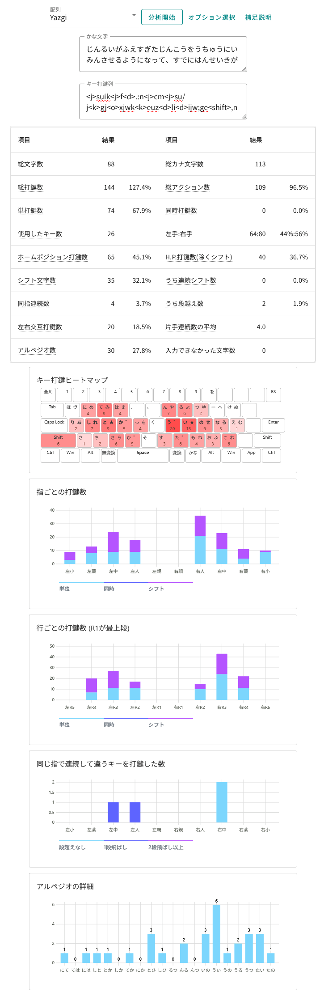
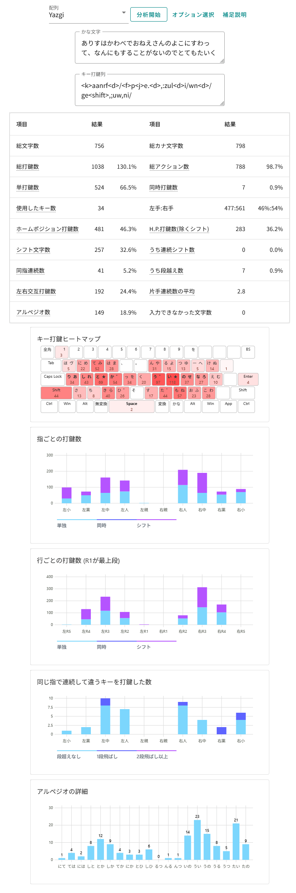
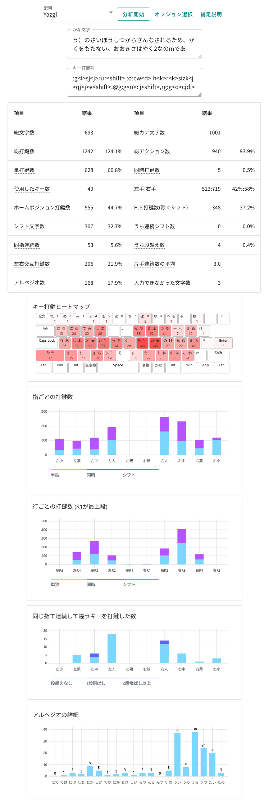

# 性能分析

> [!Note]
> 以下は、v0.1.4 時点での測定結果です。

[keyboard_analyzer_jisgeta_yazgi](https://github.com/ffunatsu/keyboard_analyzer_jisgeta_yazgi) （日本語キー配列アナライザー、フォークしてJIS下駄とYazgiを追加した版） を使って分析。

上ツールのGitHub Pages版は[こちら](https://ffunatsu.github.io/keyboard_analyzer_jisgeta_yazgi_static/)。

## 注意

なお、以下は `、` と `。` は、QWERTY同様に Shift + `,` と Shift + `.` を使ったバージョンであることに注意。

## 計測1: デフォルト文章

- 入力文章:

> 人類が増えすぎた人口を宇宙に移民させるようになって、既に半世紀が過ぎていた。地球の周りの巨大な人工都市は人類の第二の故郷となり、人々はそこで子を産み、育て、そして死んでいった。

- キー打鍵列:

> `<j>suik<j>f<d>.:n<j>cm<j>su/j<k>gj<o>xjwk<k>euz<d>li<d>ijw;ge<shift>,n<j>ewru<d>lkc<j>fn<j>cekm<shift>.x<o>cjl<k>r<d>/al<i>c<f>mk;<j>su/jdsr<j>suikl<f>mkwl/<i>cjd;a<shift>,vd<j>vdrv/<j>e/<k>gj<k>e<shift>,v<f>me<shift>,vsesu<j>ekgm<shift>.`

## 計測2: 不思議の国のアリス

- 入力文章:

>アリスは川辺でおねえさんのよこにすわって、なんにもすることがないのでとても退屈（たいくつ）しはじめていました。一、二回はおねえさんの読んでいる本をのぞいてみたけれど、そこには絵も会話もないのです。「絵や会話のない本なんて、なんの役にもたたないじゃないの」とアリスは思いました。
>
>そこでアリスは、頭のなかで、ひなぎくのくさりをつくったら楽しいだろうけれど、起きあがってひなぎくをつむのもめんどくさいし、どうしようかと考えていました（といっても、昼間で暑いし、とってもねむくて頭もまわらなかったので、これもたいへんだったのですが）。そこへいきなり、ピンクの目をした白うさぎが近くを走ってきたのです。それだけなら、そんなにめずらしいことでもありませんでした。さらにアリスとしては、そのうさぎが「どうしよう！　どうしよう！　ちこくしちゃうぞ！」とつぶやくのを聞いたときも、それがそんなにへんてこだとは思いませんでした（あとから考えてみたら、これも不思議に思うべきだったのですけれど、でもこのときには、それがごく自然なことに思えたのです）。でもそのうさぎがほんとうに、チョッキのポケットから懐中時計（かいちゅうどけい）をとりだしてそれをながめ、そしてまたあわててかけだしたとき、アリスもとびあがりました。
>
>というのも、チョッキのポケットなんかがあるうさぎはこれまで見たことがないし、そこからとりだす時計をもっているうさぎなんかも見たことないぞ、というのに急に気がついたからです。そこで、興味（きょうみ）しんしんになったアリスは、うさぎのあとを追っかけて野原をよこぎって、それがしげみの下の、おっきなうさぎの穴にとびこむのを、ぎりぎりのところで見つけました。次のしゅんかんに、アリスもそのあとを追っかけてとびこみました。

- キー打鍵列:

> `<k>aanrf<d>/<f>p<j>e.<d>,:zul<d>i/wn<d>/ge<shift>,;uw,ni/d<j>f;kl<j>ede,mkho<j>hmkhosr<j>s<k>wek<k>rsm<shift>.kx<shift>,wfkr.<d>,:zul<d>iu<j>ekiqu<k>gl<j>vke<k>em@<k>s<j>d<shift>,v/wr:,fk<d>/,;kl<j>en<shift>.<g>f:<d>ufk<d>/l;kqu;ue<shift>,;ul<d>uhw,mm;k<u>z;kld<k>aanr.,k<k>rsm<shift>.enterenterv/<j>e<k>aanr<shift>,<k>am<k>rl;f<j>e<shift>,v;<j>chlhza<k>gohgm<k>cmlsk<f>m<d>;j@<k>s<j>d<shift>,.c<k>a<j>fgev;<j>ch<k>go<d>:l,<k>wu<j>dhzks<shift>,<j>djs<d>ijfdfu<j>f:ek<k>rsm<j>hdkge,<shift>,vi<k>r<j>e<k>aoks<shift>,dge,<d>,<d>:he<k>am<k>r,<k>r<d>/<k>c;fgml<j>e<shift>,/<k>s,mk<d>pu<f>mgml<j>en<j>f<shift>.v/<d>pkc;a<shift>,<m>vuhl<k>w<k>gsmrhjz<j>c<j>fxfh<k>grsgecml<j>en<shift>.v<k>s<f>m@;<k>c<shift>,vu;w<k>w<f>n<k>csk/d<j>e,<k>aa<k>r<d>lu<j>esm<shift>.z<k>cw<k>aandser<shift>,vljz<j>c<j>f<g>f<j>djs<d>ij<shift>1space<j>djs<d>ij<shift>1spacex/hs<u>xj<j>v<shift>1do<f>.<d>uhl<k>gckmdc,<shift>,v<k>s<j>fvu;w<d>pue/<f>mdr.,k<k>r<d>lu<j>esm<j>h<k>adf<k>cfu<j>f:e<k>em<k>c<shift>,/<k>s,<d>.s<j>cw.,j<f>pc<f>mgml<j>en@<k>s<j>d<shift>,<j>e,/ldcwr<shift>,v<k>s<j>f<j>/hs<f>@u;/dw.,:ml<j>en<shift>.<j>e,vljz<j>c<j>fqudjw<shift>,<i>xgcl<m>q@gdf<k>cfk<o>xj<j>d@k<j>hfk<o>xj<j>d@k<k>gda<f>msev<k>s<k>g;<j>f<k>w<shift>,vse<k>rm<k>a<d>/eef@<f>msmdc<shift>,<k>aan,d<j>v<k>a<j>fa<k>rsm<shift>.enterenterdkjl,<shift>,<i>xgcl<m>q@gd;uf<j>f<k>aijz<j>cr/<k>s<k>r<j>e<k>em/d<j>f;ks<shift>,v/f<k>cda<f>mnd@k<k>g,gekijz<j>c;uf,<k>em/d;k<j>v<shift>,dkjlw<o>cjwc<j>fokmf<k>c<j>en<shift>.v/<j>e<shift>,<i>cj<k>e<j>h<i>cj<k>esusuw;gm<k>aanr<shift>,jz<j>cl<k>ad<k>g.gf@elr<k>c<k>g<d>i/<j>cge<shift>,v<k>s<j>fs<f>[<k>elsml<shift>,.gc;jz<j>cl<k>a;wd<j>v/<d>:l<k>g<shift>,<j>ca<j>cald/<d>;<j>e<k>eo@<k>rsm<shift>.o<j>cl<o>sufuw<shift>,<k>aan,vl<k>ad<k>g.gf@ed<j>v/<k>e<k>rsm<shift>.`

## 計測3: Wikipedia - 血小板

- 入力文章:

>血小板は、血液に含まれる細胞で、赤血球、白血球と並ぶ第三の血球系である。骨髄中の巨核球（巨大核細胞）の細胞質から産生されるため、核を持たない。大きさは約2ナノmであり、赤血球や白血球の細胞よりも小さい。正常状態の血中には15万～40万個/マイクロL程度含まれている。血小板は、何種類かの血液凝固因子を含んでおり、これらは血小板のアルファ顆粒や濃染顆粒内に含まれている。出血などで血管内皮細胞が傷害を受けると、血小板内の細胞骨格系が変化すると同時に、新たに細胞膜上に細胞接着因子の受容体が発現する。これを血小板の活性化と呼ぶ。これらの糖タンパク受容体やその他の接着因子などを介して血小板は血管内皮に接着し、血小板どうしが凝集し傷口を塞いで血栓を形成する。これを一次止血と呼ぶ。その後、ここから各種凝固因子が放出されることによって、血液中にあるフィブリンが凝固し、さらに血小板や赤血球が捕らわれて、強固な止血栓が完成する。これを二次止血と呼ぶ。体外で固まった血小板とフィブリンおよびそれに捕らわれた赤血球の塊が乾燥したものは「かさぶた」と呼ばれる。（凝固・線溶系も参照）
>
>形態は、非活性状態では円盤状の形態であるが、出血などで血管内皮細胞が傷害を受けると活性化し、偽足（あるいは仮足）とよばれるアメーバ状の突起を伸ばして胞体を伸展させ、最終的には扁平状あるいは球状に変化する。さらに内皮細胞への粘着後には、血小板内部の顆粒が細胞骨格の成分の一つであるアクチンフィラメントによって中央にたぐり寄せられ、目玉焼きのような形態となる。（これは顆粒などの細胞小器官が中央部へと集まるからである。）

- キー打鍵列:

> `@g<i>sj<j>rur<shift>,@o:cw<d>.h<k>r<k>sizk<j>qj<j>e<shift>,<d>lg@g<o>cj<shift>,rg@g<o>cjd;<k>c<f>.<f>mkzul@g<o>cj@k<j>e<k>ai<shift>./o<f>ok<o>xjlfh<f>m<k>r<j>h<i>c<f>mkfhzk<j>qjlzk<j>qjsof<k>czu;z<k>sim<k>w<shift>,fh<k>g,m;k<shift>...czr<d>uh2;lm<j>e<k>aa<shift>,<d>lg@g<o>cj<d>urg@g<o>cjlzk<j>qj<d>ia,xkzk<shift>.<d>lk<i>zj<i>zjmklx<o>xjwr15<k>ru<shift>^40<k>ru//<k>rkh<d>;<shift>lek<j>d<d>.h<k>r<k>seki<shift>.@g<i>sj<j>rur<shift>,;w<o>sikfl@o:c<j>c<v>8j/kus<k>g<d>.hu<j>e.a<shift>,/<k>s<k>cr@g<i>sj<j>rul<k>ai<u>ff<o>aj<d>u/v<k>wf<o>aj;kw<d>.h<k>r<k>seki<shift>.<o>sg@o;<j>d<j>e@gfu;kvzk<j>qj<j>f<i>sj<j>fk<k>gj@id<shift>,@g<i>sj<j>ru;klzk<j>qj/gfh@k<j>f<d>pufnid<j>dj<j>sw<shift>,<k>a<k>cmwzk<j>qj<k>rh<i>zjwzk<j>qj<d>lg<u>xhkusl<o>z<d>ijmk<j>fro<f>[uni<shift>./<k>s<k>g@g<i>sj<j>rulfg<d>lkfd<d>i<f>.<shift>./<k>s<k>cldjmu<m>rh<o>z<d>ijmk<d>uvlml<d>lg<u>xhkus;<j>d<k>gfkse@g<i>sj<j>rur@gfu;kvw<d>lg<u>xhs<shift>,@g<i>sj<j>ru<j>djs<j>f<j>c<v>8j<o>sjsc<f>n<f>hx<k>g<d>.zk<j>e@g<d>lu<k>g@k<d>lkni<shift>./<k>s<k>gkx<j>ss@od<d>i<f>.<shift>.vl<j>/<shift>,//f<k>cfh<o>s<j>c<v>8j/kus<j>fqj<o>soz<k>si/dw<d>ige<shift>,@o:c<o>xjw<k>ai<;>f<f>.au<j>f<j>c<v>8j/s<shift>,z<k>cw@g<i>sj<j>ru<d>u<d>lg@g<o>cj<j>fd<k>c<d>/<k>se<shift>,<i>cj/;s@o<d>lu<j>ffu<d>lkni<shift>./<k>s<k>gw<j>ss@od<d>i<f>.<shift>.mk<j>fk<j>efm<k>rgm@g<i>sj<j>rud<;>f<f>.au.<d>i<j>vv<k>swd<k>c<d>/<k>sm<d>lg@g<o>cjlfm<k>ra<j>ffuvjsm,lr<g>ffz<f>.md<d>i<j>r<k>si<shift>.<j>h<j>c<v>8j/<f>r<d>lu@k,zu<i>sjenterenter@kmkr<shift>,vfg<d>lk<i>zjmk<j>er:u<j>ru<i>zjl@kmk<j>e<k>ai<j>f<shift>,<o>sg@o;<j>d<j>e@gfu;kvzk<j>qj<j>f<i>sj<j>fk<k>gj@idfg<d>lkfs<shift>,<j>cvh<j>h<k>aikrfa<k>asd<d>i<j>r<k>si<k>a<k>wp<j>r<i>zjldgc<k>gl<j>rsemk<k>gsueuz<d>l<shift>,zk<o>sjecwr<d>pu<v>pk<i>zj<k>aikr<o>cj<i>zjw<d>pufni<shift>.z<k>cw;kvzk<j>qj<d>pl<d>,u<u>xh<j>/wr<shift>,@g<i>sj<j>ru;k<f>.lf<o>aj<j>fzk<j>qj/gfhl<d>lk<f>.ulvdo<j>e<k>ai<k>ahxu<;>f<k>c<k>wudw<d>ige<o>xj.jwm<f>ha<d>i<d>l<k>c<k>s<shift>,<k>w<f>m<k>r<d>ucl<d>ij;@kmkd;i<shift>.<j>h/<k>srf<o>aj;<j>dlzk<j>qj<i>sjcfu<j>f<o>xj.j<f>.<d>pd<k>ao<k>rif<k>c<j>e<k>ai<shift>.`

